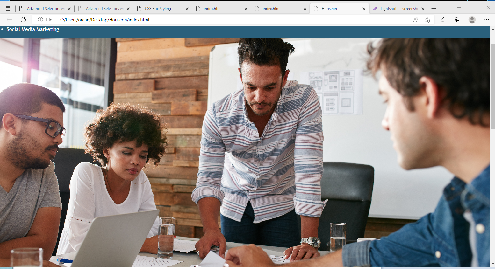
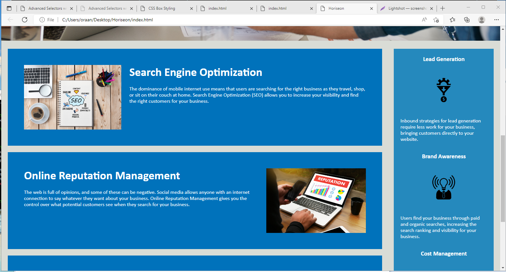

<Horiseon Challenge 1>

## Description

- This website is for the company called Horiseon. It for people to view their company and use their website for navigation and information.
- 
## Acceptance Criteria

AS A marketing agency
I WANT a codebase that follows accessibility standards
SO THAT our own site is optimized for search engines
GIVEN a webpage meets accessibility standards
WHEN I view the source code
THEN I find semantic HTML elements
WHEN I view the structure of the HTML elements
THEN I find that the elements follow a logical structure independent of styling and positioning
WHEN I view the image elements
THEN I find accessible alt attributes
WHEN I view the heading attributes
THEN they fall in sequential order
WHEN I view the title element
THEN I find a concise, descriptive title
If your README is long, add a table of contents to make it easy for users to find what they need.

What are the steps required to install your project? Provide a step-by-step description of how to get the development environment running.

## Usage

Screenshot:

The app can be found at https://oraanlevi.github.io/Horiseon/
   

# Credits

My Git Hub link:

https://github.com/oraanlevi/Horiseon

